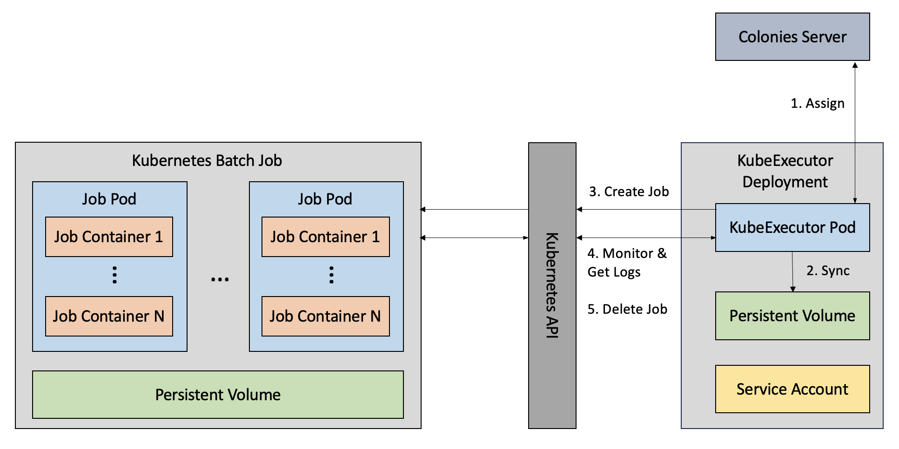

# Introduction
The KubeExecutor enables execution of Colonies jobs as Kubernetes batch jobs. Notably, the same Colonies jobs can alternatively be executed on High Performance Computing (HPC) systems using the HPCExecutor (which is based on Slurm). This flexibility enables seamless portability between Kubernetes and HPC Slurm environments.

The workflow is depicted in the following diagram:



Here's how the KubeExecutor operates on a Kubernetes cluster:

**1. Process Assignments:** The KubeExecutor establishes a connection to the Colonies server and requests process assignments.

**2. Data Preparation:** If a filesystem is specified, the KubeExecutor downloads all necessary data to a Persistent Volume that is shared across all spawned batch jobs.

**3. Job Creation:** Subsequently, the KubeExecutor initiates the creation of a Kubernetes (K8s) batch job.

** 4. Monitoring and Log Upload:** The KubeExecutor closely monitors the execution lifecycle of the batch job, ensuring that all logs are promptly uploaded to the Colonies server.

**5. Job Completion and Cleanup:** Upon the successful completion of the batch job, the KubeExecutor proceeds to delete the job from the Kubernetes cluster.

## Usage

```json
{
    "conditions": {
        "executortype": "kubeexecutor",
        "nodes": 2,
        "processes-per-node": 2 
        "mem": "1Gi",
        "cpu": "500m",
        "walltime": 60
    },
    "funcname": "execute",
    "kwargs": {
        "cmd": "echo",
        "docker-image": "busybox",
        "rebuild-image": false,
        "args": [
            "Hello, World!"
        ],
    },
    "maxwaittime": -1,
    "maxexectime": 100,
    "maxretries": 3
}
```
