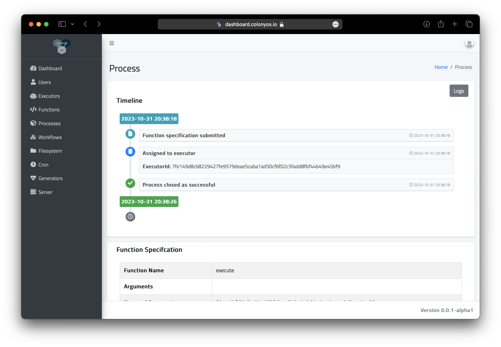
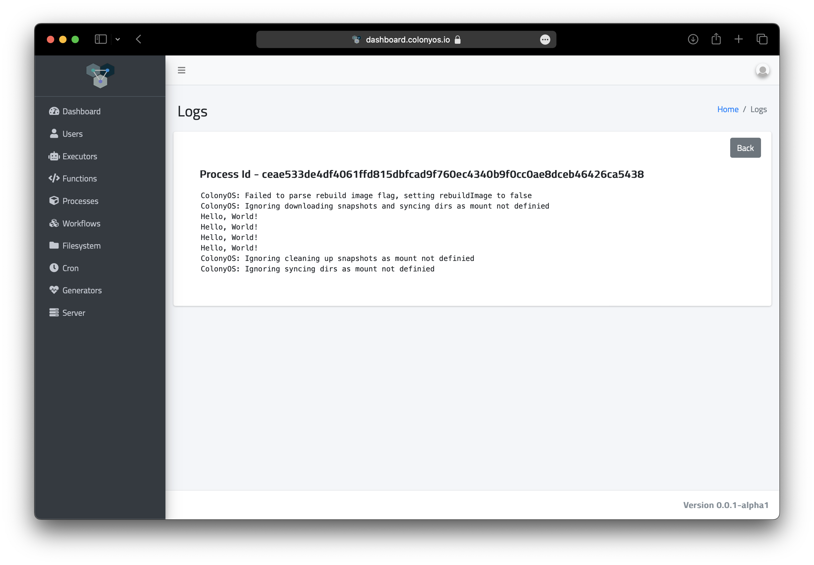
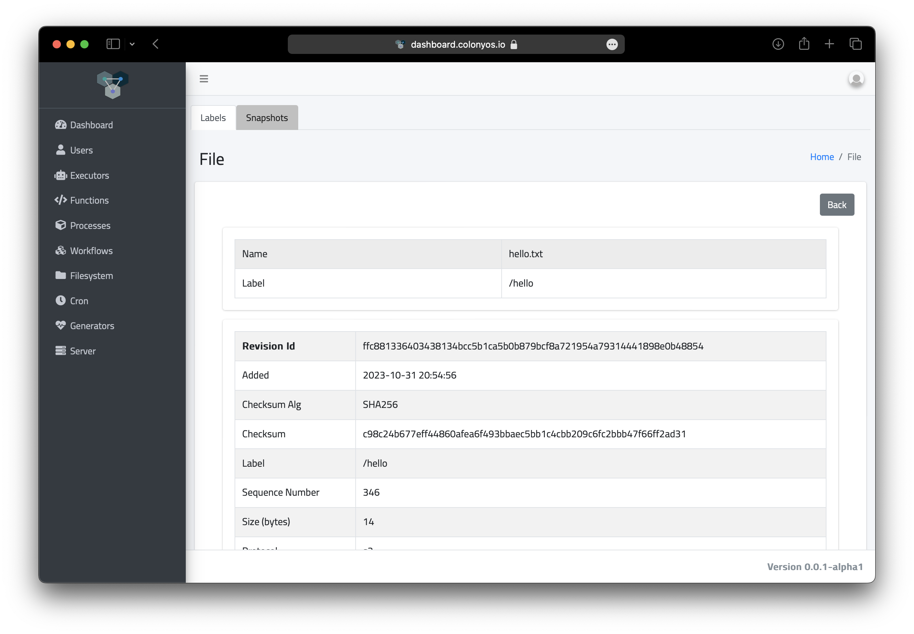

# Introduction
The KubeExecutor enables execution of Colonies processes as Kubernetes batch jobs. Note that the same Colonies jobs can alternatively be executed on High Performance Computing (HPC) systems using the [HPCExecutor](https://github.com/colonyos/executors/tree/main/hpc) (which is based on Slurm). This flexibility enables seamless portability between Kubernetes and HPC environments.

The workflow is depicted in the following diagram:


Here's how the KubeExecutor operates on a Kubernetes cluster:

**1. Process Assignments:** The KubeExecutor establishes a connection to the Colonies server and requests a process execution assignment.

**2. Data Preparation:** If a filesystem is specified, the KubeExecutor downloads all necessary data to a Persistent Volume that is shared across all spawned batch jobs.

**3. Job Creation:** Subsequently, the KubeExecutor creates a Kubernetes batch job.

**4. Monitoring and Log Upload:** The KubeExecutor closely monitors the execution lifecycle of the batch job, ensuring that all logs are promptly uploaded to the Colonies server.

**5. Job Completion and Cleanup:**  After the batch job has complemeted, the KubeExecutor proceeds to delete the job from the Kubernetes cluster.

## Colonies function specification
Colonies jobs are described as so-called function specifications. Below is an example of a function specification.

```json
{
    "conditions": {
        "executortype": "kubeexecutor",
        "nodes": 2,
        "processes-per-node": 2,
        "mem": "1Gi",
        "cpu": "500m",
        "walltime": 90
    },
    "funcname": "execute",
    "kwargs": {
        "cmd": "echo",
        "docker-image": "busybox",
        "args": [
            "Hello, World!"
        ]
    },
    "maxexectime": 80,
    "maxretries": 3
}
```

* The **condition** object outlines the requirements for an acceptable executor. In this case, an executor must be of the **kubeexecutor** type to be assigned this function specification. 

* We specify a requirement for 2 **nodes**. This directly translates to the number of pods in the batch job. We also request 2 **processes per node**. This correlates to number of containers within each pod. Each container is allocated 1Gi of memory and 0.5 cores. In total, we will allocate 4Gi memory and request 2 CPU cores.

* The **walltime** parameter determines the maximum lifespan of the Kubernetes job. If a job exceeds this limit, it's automatically removed from the Kubernetes cluster. This mechanism ensures that batch jobs that stall or hang don't persist indefinitely. In this case, the job is deleted after 90 seconds.

* The **maxexectime** parameter set the maximum time a process can run before it's automatically unassigned and sent back to the Colonies server. While **walltime** controls the lifespan of the Kubernetes job, **maxexectime** governs the lifespan of a Colonies process.
It's hence crucial that the value of **walltime** is set greater than that of **maxexectime**.

* The **maxretries** parameter sets a limit on the number of times a process can be unassigned due to issues or failures. After reaching this limit, the process is closed as failed and will no longer be eligible for reassignment to another executor.

* The **funcname** defines the name of function we would like to call on the executor. The **execute** function spawns batch jobs. Additionaly, the **kwargs** parameter represents the arguments passed to the **execute** function. This defines the exact process to be executed. In this particular example, we wish to run the command **echo Hello, World!** within the busybox Docker container.

### Submitting a job
```console
colonies function submit --spec helloworld.json 
```




## Colonies filesystem 
Let's make the example a little bit more advanced. Let's see how we can use the Colonies meta-filesystem to automatically transfer data to a Colonies process. 

Start by creating a directory named **hello**. Inside this directory, produce a text file (hello.txt) containing the phrase "Hello, World!".
```console
mkdir hello
echo "Hello, World!" > hello/hello.txt 
```

Once the file is created, we need to upload it to the Colonies filesystem. In this example, we're assigning it the label **hello**.

```console
colonies fs sync -l hello -d hello --yes
 Uploading hello.txt 100% [===============] (48 kB/s)
```



Let's create a Colonies process that prints the content of the hello.txt file to standard out. The following code will automatically fetch the content associated with the **hello** label and save it to the **/cfs/hello** directory. This directory is mounted on a Kubernetes Persistent Volume, making it accessible to any created batch job.

```json
{
    "conditions": {
        "executortype": "borg-kubeexecutor",
        "nodes": 2,
        "processes-per-node": 2,
        "mem": "1Gi",
        "cpu": "500m",
        "walltime": 90
    },
    "funcname": "execute",
    "kwargs": {
        "cmd": "cat",
        "docker-image": "busybox",
        "args": [
            "/cfs/hello/hello.txt"
        ]
    },
    "fs": {
        "mount": "/cfs",
        "dirs": [
            {
                "label": "/hello",
                "dir": "/hello",
                "keepfiles": true,
                "onconflicts": {
                    "onstart": {
                        "keeplocal": false
                    },
                    "onclose": {
                        "keeplocal": true
                    }
                }
            }
        ]
    },
    "maxexectime": 80,
    "maxretries": 3
}
```

The KubeExecutor performs filesystem synchronization twice: initially before the batch job starts, and a second time after the batch job is completed. The **onconflicts** attribute determines the approach to managing conflicts if a file has been changed by the batch job. In this example, the file will not be uploaded back to Colonies FS.

```console
colonies function submit --spec helloworld2.json --follow

INFO[0000] Process submitted                             ProcessID=b38f3e693a7125ce209f03766879f942abf239bb0b70add98984284d1f4ac6ae
INFO[0000] Printing logs from process                    ProcessID=b38f3e693a7125ce209f03766879f942abf239bb0b70add98984284d1f4ac6ae
ColonyOS: Failed to parse rebuild image flag, setting rebuildImage to false
ColonyOS: Starting directory synchronization: Label:/hello Dir:/cfs/hello Download:1 Upload:0 Conflicts:0 ConflictResolutionStrategy:keepremote
Hello, World!
Hello, World!
Hello, World!
Hello, World!
ColonyOS: Starting directory synchronization: Label:/hello Dir:/cfs/hello Download:0 Upload:0 Conflicts:0 ConflictResolutionStrategy:keeplocal
INFO[0011] Process finished successfully                 ProcessID=b38f3e693a7125ce209f03766879f942abf239bb0b70add98984284d1f4ac6ae
```

Change the content of the hello.txt to something else and submit another job.

```console
echo "ColonyOS rocks!" > hello/hello.txt 
colonies fs sync -l hello -d hello --yes
 Uploading hello.txt 100% [===============] (135 kB/s)
```
 
Submit a new function specification.
```console
colonies function submit --spec helloworld_fs.json --follow                                   21:17:21

INFO[0000] Process submitted                             ProcessID=be994d78e791936a273d582e6829d6e62ba2c7e52ce438ced011627c737fb37f
INFO[0000] Printing logs from process                    ProcessID=be994d78e791936a273d582e6829d6e62ba2c7e52ce438ced011627c737fb37f
ColonyOS: Failed to parse rebuild image flag, setting rebuildImage to false
ColonyOS: Starting directory synchronization: Label:/hello Dir:/cfs/hello Download:0 Upload:0 Conflicts:0 ConflictResolutionStrategy:keepremote
ColonyOS rocks!
ColonyOS rocks!
ColonyOS rocks!
ColonyOS rocks!
ColonyOS: Starting directory synchronization: Label:/hello Dir:/cfs/hello Download:0 Upload:0 Conflicts:0 ConflictResolutionStrategy:keeplocal
INFO[0019] Process finished successfully                 ProcessID=be994d78e791936a273d582e6829d6e62ba2c7e52ce438ced011627c737fb37f
```

## GPUs
TODO

## Using Colonies FS to execute code
TODO
